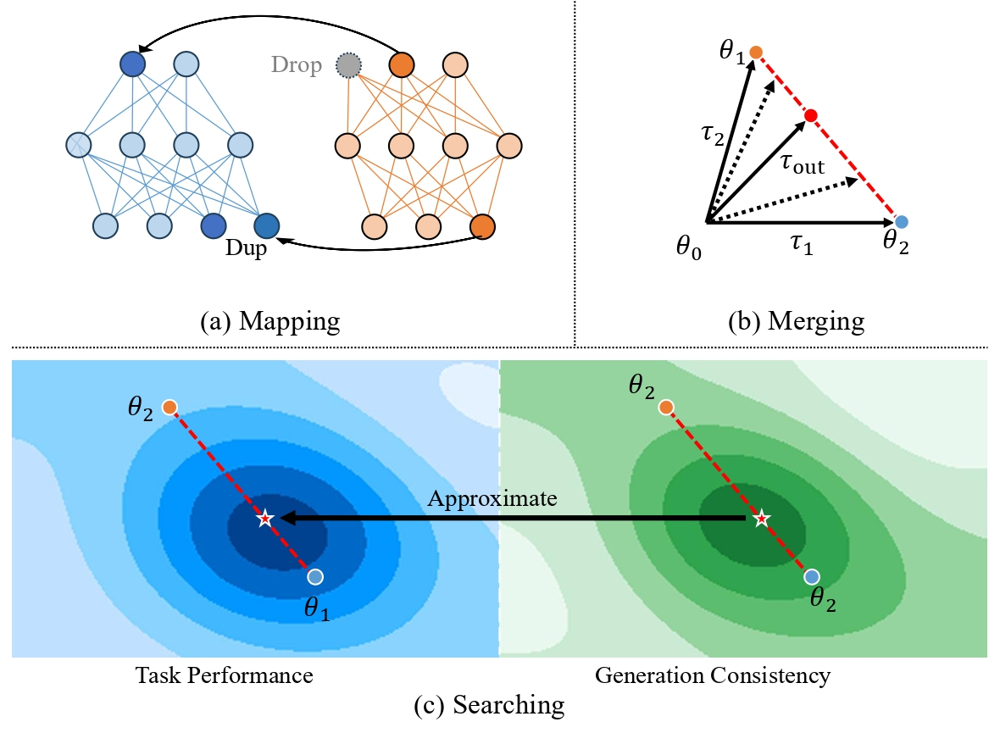
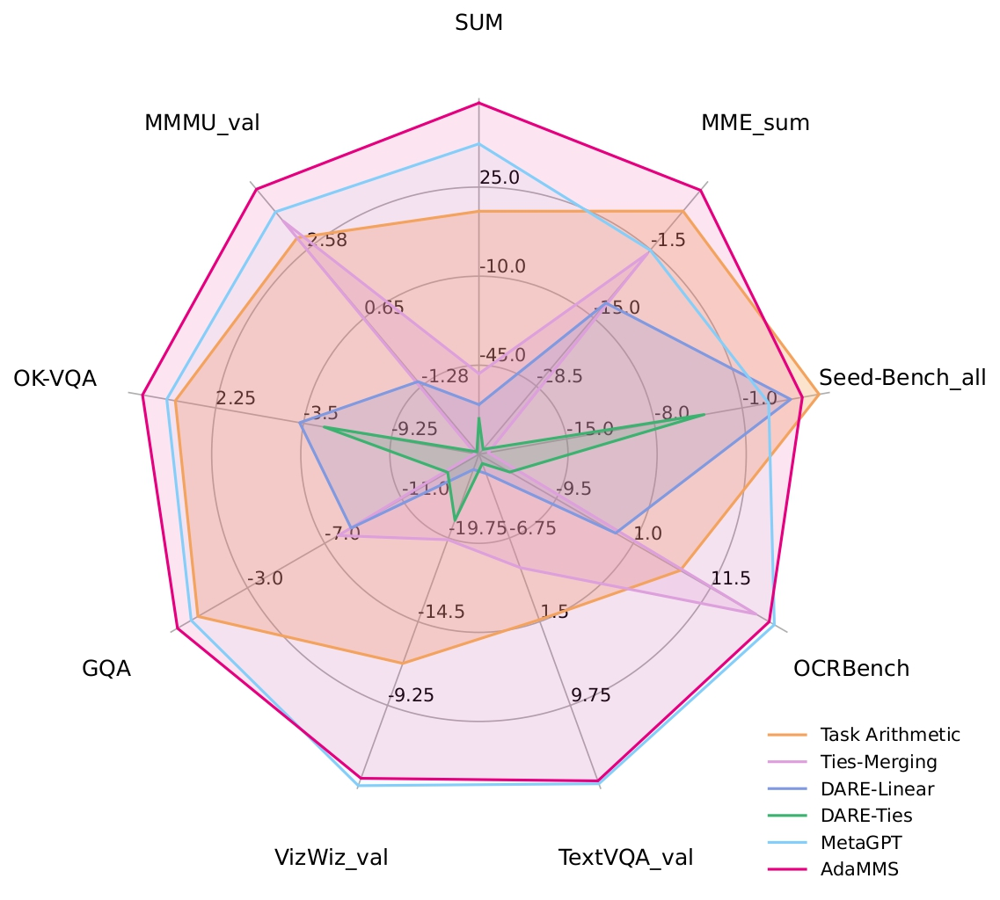
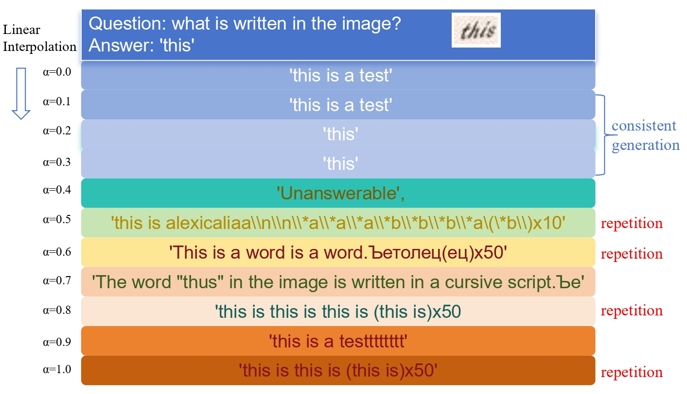

<h1 align="center">🚀 AdaMMS: Adaptive Model Merging for Heterogeneous Multimodal LLMs</h1>
<p align="center">
  
  
  
  
</p>

<p align="center">🔥 Accepted to CVPR 2025!</p>

---

<p align="center">
  <b>🌐 Language:</b>
  <a href="#english-version">🇺🇸 English</a> | 
  <a href="#中文版说明">🇨🇳 中文</a>
</p>

## Introduction

Recent advancements in model merging have shown great potential in combining capabilities from multiple large language models (LLMs). However, existing methods primarily focus on merging **homogeneous models** with identical architectures, struggling when applied to **heterogeneous Multimodal Large Language Models (MLLMs)** that differ in both architecture and parameter space.

We propose **AdaMMS**: **Ada**ptive **M**apping, **M**erging, and **S**earching — a novel unsupervised model merging framework tailored for heterogeneous MLLMs. AdaMMS tackles the challenges in three steps:

1. 🧠 **Mapping**  
   Establish a mapping function between different model architectures.

2. ⚖️ **Merging**  
   Perform weighted linear interpolation to accommodate asymmetries in parameter space.

3. 🔍 **Searching**  
   Introduce an unsupervised hyperparameter search method to determine optimal merging coefficients.

📊 Extensive experiments show that AdaMMS consistently outperforms previous model merging methods on various vision-language benchmarks.

Here is the illustration of three steps in AdaMMS:



Here is the average results from different mnerging methods:



This is a visualization of the model outputs obtained with different alpha values：




---

## 🛠️ Environment Setup

> ⚠️ It's recommended to set up environments **individually for each model**, then install the `lmms-eval` evaluation framework.
>
> 

~~~markdown
### ✅ Example: CogVLM

```bash
conda create -n lmms-cogvlm python=3.10
conda activate lmms-cogvlm

wget https://github.com/THUDM/CogVLM/blob/main/requirements.txt --no-check-certificate
pip install -r requirements.txt
python -m spacy download en_core_web_sm

git clone https://github.com/EvolvingLMMs-Lab/lmms-eval
cd lmms-eval && pip install -e .

conda install openjdk=8

########################
### ✅ Example: mPLUG-Owl
conda create -n lmms-mplug python=3.10
conda activate lmms-mplug

git clone https://github.com/X-PLUG/mPLUG-Owl.git
cd mPLUG-Owl/mPLUG-Owl2
pip install --upgrade pip && pip install -e .

git clone https://github.com/EvolvingLMMs-Lab/lmms-eval
cd lmms-eval && pip install -e .

conda install openjdk=8
pip install deepspeed  # Optional for inference acceleration
~~~

### 

------

## 🔄 Merge Scripts

> Naming convention: `xxx2yyy.py` indicates merging model `xxx` into architecture `yyy`.

### 📈 Linear Interpolation Scripts

| Source Model         | Target Model | Script File            |
| -------------------- | ------------ | ---------------------- |
| LLaVA                | CogVLM       | `llava2cogvlm.py`      |
| mPLUG-Owl            | CogVLM       | `mplugowl2cogvlm.py`   |
| LLaVA-OneVision-Qwen | QwenVL2      | `llava-qwen2qwenvl.py` |

### 🧬 Non-Linear Merging (Baseline)

| Source Model         | Target Model | Script File                         |
| -------------------- | ------------ | ----------------------------------- |
| LLaVA                | CogVLM       | `llava2cogvlm_ties_merging.py`      |
| mPLUG-Owl            | CogVLM       | `mplugowl2cogvlm_ties_merging.py`   |
| LLaVA-OneVision-Qwen | QwenVL2      | `llava-qwen2qwenvl_ties_merging.py` |

------

## ⚙️ Merging + Inference

> 📝 Refer to `runs/` for example scripts. Logging results helps identify the best alpha. Find more details for inference in https://github.com/EvolvingLMMs-Lab/lmms-eva .

### 🧪 Run Merge Script

```bash
conda activate lmms-cogvlm
python $MERGE_SCRIPT --output $ckpt_path --alpha $alpha \
       --base $BASE_MODEL_PATH --base_llava $LLAVA_PATH \
       --interpolation
```

### 🚀 Batch Evaluation for Multiple Alphas (0.4~1.0)

```bash
#!/bin/bash

for alpha in 1.0 0.9 0.8 0.7 0.6 0.5 0.4; do
    echo "===> Alpha: $alpha"
    
    # Merge
    python3 $MERGE_SCRIPT --output $ckpt_path --alpha $alpha --interpolation \
        --base COGVLM_PATH --llava_base LLAVA_PATH

    # Evaluate
    for task in "mme" "mmmu_val" "nocaps_val" "vizwiz_vqa_val" "seedbench"  "gqa" "ok_vqa" "refcoco_bbox_testA" "refcocog_bbox_test" "refcoco+_bbox_testA" "mmbench" "ocrbench" ; do
        CUDA_VISIBLE_DEVICES=$GPU accelerate launch \
            --num_processes=1 \
            -m lmms_eval \
            --model cogvlm \
            --model_args pretrained=$ckpt_path,... \
            --tasks $task \
            --log_samples \
            --output_path $output_path
    done

    rm -rf $ckpt_path
done
```

------

## 🔍 Alpha Selection

After evaluating different alphas, run the following script to auto-select the best one:

```bash
python search/view_log_delta_perdata_search_limit.py
```

This will output the best `alpha` and its performance logs.

------

## 🧩 Merge Logic (Example: `llava2cogvlm.py`)

### 1️⃣ Load Parameters

- Check if parameter should be merged: `need_merge(key)`
- Scale base model:

```python
cogvlm_diff[key] = (cogvlm_chat[key] * alpha)
```

### 2️⃣ Merge Parameters

- **Linear**:

```python
cogvlm_diff['lm_head.weight'] += llava['lm_head.weight']
```

- **Non-linear**: Call `do_merging()` or `do_merging_strategy()` from `ties_merging.py`.

### 3️⃣ Save Parameters

- Compatible with both `torch` and `safetensors`.
- For `safetensors`, metadata is required.

------

## 🤝 Contributions

We welcome PRs and issues! 🌟
 AdaMMS aims to improve the efficiency of heterogeneous multimodal model merging and support your research in MLLMs.

------

## 📄 Citation

If you find this project helpful, please cite:

```bibtex
@misc{adamms2025,
  title={AdaMMS: Model Merging for Heterogeneous Multimodal Large Language Models with Unsupervised Coefficient Optimization},
  author={Yiyang Du and Xiaochan Wang},
  booktitle={CVPR},
  year={2025}
}
```

------

## 🇨🇳 中文版说明

👉 请点击此链接跳转 [中文版 README](https://poe.com/chat/3b1s7x5f490w9n5qpy7#项目简介)

